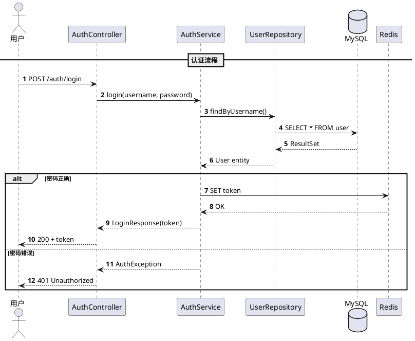
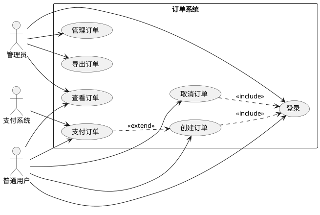
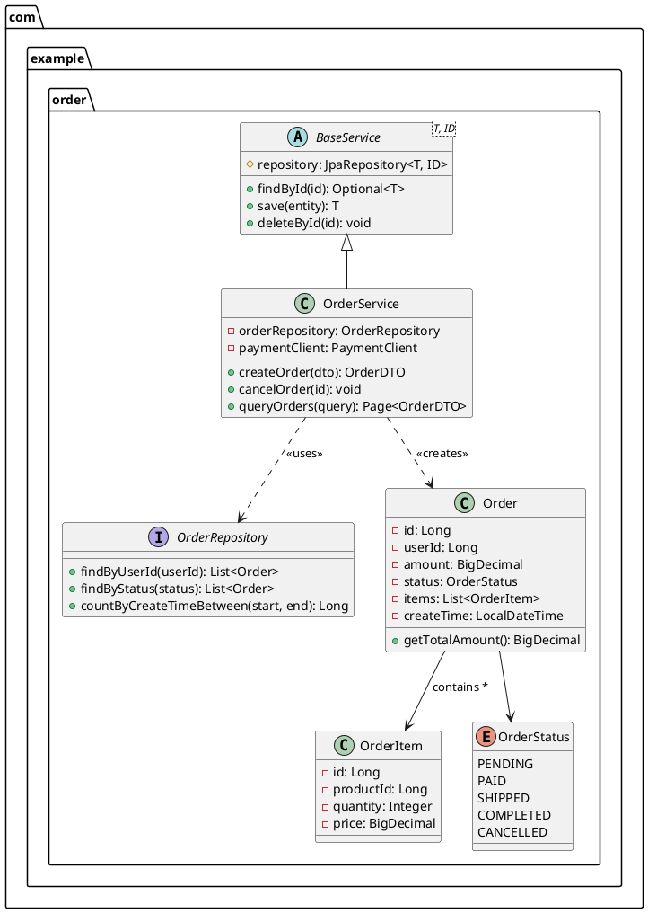
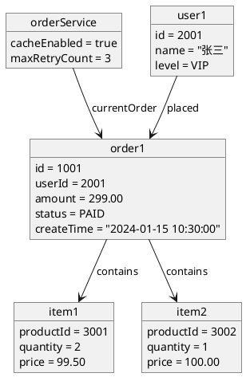
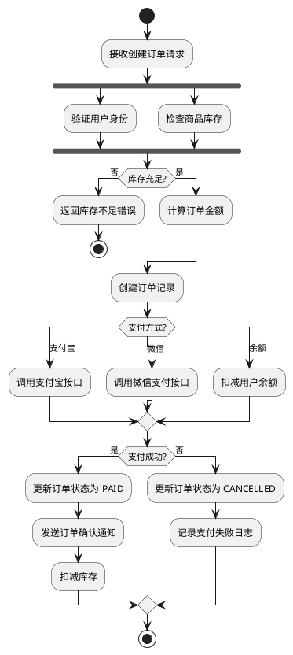
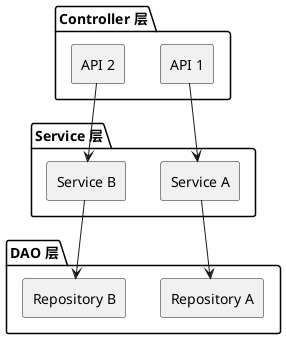

# PlantUML Syntax Templates

## Table of Contents

- [PlantUML Syntax Templates](#plantuml-syntax-templates)
  - [Table of Contents](#table-of-contents)
  - [Sequence Diagram](#sequence-diagram)
  - [Use Case Diagram](#use-case-diagram)
  - [Class Diagram](#class-diagram)
  - [Object Diagram](#object-diagram)
  - [Activity Diagram](#activity-diagram)
  - [Architecture Diagram](#architecture-diagram)

---

## Sequence Diagram



**关键语法：**

| 语法 | 含义 |
|------|------|
| `->` | 同步消息（实线箭头） |
| `-->` | 返回消息（虚线箭头） |
| `->>` | 异步消息（细箭头） |
| `autonumber` | 自动编号 |
| `actor` | 参与者（人形） |
| `participant` | 参与者（方框） |
| `database` | 数据库 |
| `queue` | 消息队列 |
| `boundary` | 边界/网关 |
| `control` | 控制器 |
| `entity` | 实体 |
| `== Label ==` | 分隔线 |
| `note over` | 跨参与者注释 |
| `note left/right of` | 侧边注释 |
| `alt/else/end` | 条件分支 |
| `opt` | 可选块 |
| `loop` | 循环块 |
| `par/end` | 并行块 |
| `break` | 中断块 |

---

## Use Case Diagram



**关键语法：**

| 语法 | 含义 |
|------|------|
| `actor` | 参与者 |
| `usecase` | 用例 |
| `rectangle` | 系统边界 |
| `-->` | 关联 |
| `..>` + `<<include>>` | 包含关系 |
| `..>` + `<<extend>>` | 扩展关系 |
| `left to right direction` | 从左到右布局 |
| `top to bottom direction` | 从上到下布局 |

---

## Class Diagram



**关键语法：**

| 语法 | 含义 |
|------|------|
| `class` | 普通类 |
| `abstract class` | 抽象类 |
| `interface` | 接口 |
| `enum` | 枚举 |
| `+` | public |
| `-` | private |
| `#` | protected |
| `<|--` | 继承 |
| `..|>` | 实现 |
| `-->` | 关联 |
| `*--` | 组合 |
| `o--` | 聚合 |
| `..>` | 依赖 |
| `package` | 包 |
| `--` 隐藏标签 | 省略关系标签 |

---

## Object Diagram



**关键语法：**

| 语法 | 含义 |
|------|------|
| `object "name" as alias` | 对象声明 |
| `{ fields }` | 对象属性 |
| `-->` | 链接 |
| `: label` | 链接标签 |

---

## Activity Diagram



**关键语法：**

| 语法 | 含义 |
|------|------|
| `start` / `stop` | 开始/结束 |
| `:action;` | 动作 |
| `if/then/else/endif` | 条件分支 |
| `switch/case/endswitch` | 多分支 |
| `fork/fork again/end fork` | 并行 |
| `repeat/repeat while (cond)` | repeat-until 循环 |
| `while (cond) is (label)/endwhile` | while 循环 |
| `|Swimlane|` | 泳道 |
| `detach` | 分离箭头 |
| `-->` | 转换箭头 |

**泳道示例：**

```plantuml
|用户|
start
:提交订单;

|订单服务|
:创建订单;

|支付服务|
:处理支付;

|用户|
:收到确认;
stop
```

---

## Architecture Diagram

```plantuml
@startuml system-architecture
skinparam componentStyle rectangle
skinparam backgroundColor #FEFEFE
skinparam shadowing false

!define CLIENTS #LightBlue
!define GATEWAY #LightGreen
!define SERVICES #LightYellow
!define INFRA #LightGray

package "客户端" CLIENTS {
  [Web App] as web
  [Mobile App] as mobile
  [Open API] as openapi
}

package "API 网关层" GATEWAY {
  [Gateway\n(Spring Cloud Gateway)] as gw
}

package "业务服务层" SERVICES {
  package "用户服务" {
    [UserController] as uc
    [UserService] as us
  }
  package "订单服务" {
    [OrderController] as oc
    [OrderService] as os
  }
  package "商品服务" {
    [ProductController] as pc
    [ProductService] as ps
  }
}

package "基础设施层" INFRA {
  database "MySQL\n(主从)" as db
  queue "RabbitMQ" as mq
  [Redis Cluster] as redis
  [ElasticSearch] as es
  participant "OSS" as oss
}

web --> gw : HTTPS
mobile --> gw : HTTPS
openapi --> gw : HTTPS

gw --> uc
gw --> oc
gw --> pc

uc --> us
oc --> os
pc --> ps

us --> db
os --> db
ps --> db

os --> mq : 下单事件
os --> redis : 缓存
ps --> es : 搜索索引
ps --> oss : 商品图片
@enduml
```

**关键语法：**

| 语法 | 含义 |
|------|------|
| `[Component]` | 组件 |
| `package` | 分组/包 |
| `database` | 数据库 |
| `queue` | 消息队列 |
| `participant` | 云服务 |
| `node` | 部署节点 |
| `interface` | 端口/接口 |
| `skinparam` | 全局样式 |
| `!define` | 宏定义（用于颜色等） |
| `-->` | 实线连接 |
| `..>` | 虚线连接（弱依赖） |
| `\n` | 组件内换行 |

**多层架构简化模板：**


